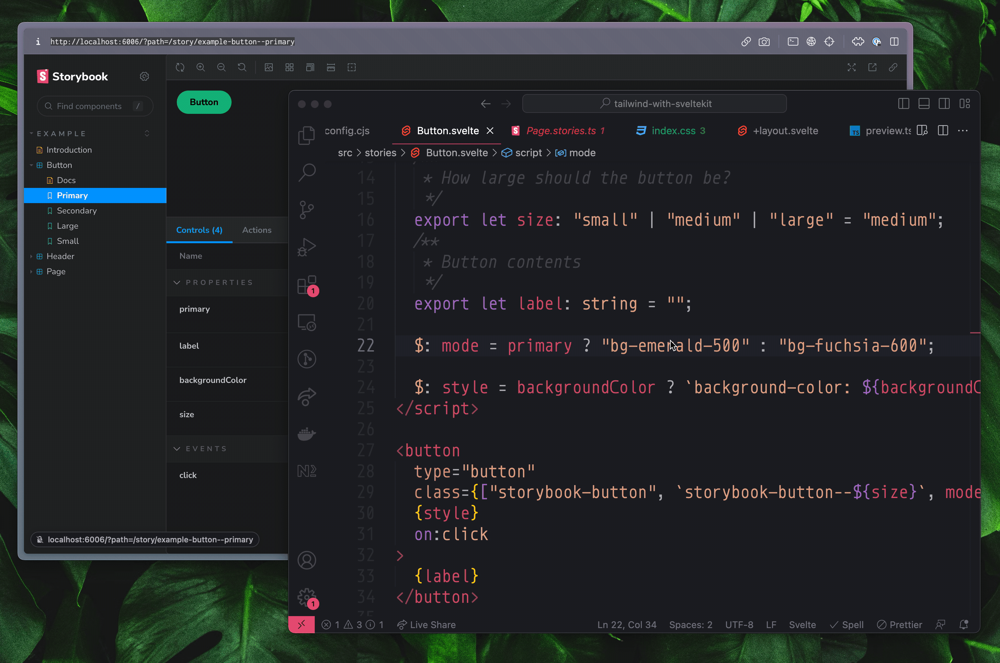

# Svelte Kit (TS) + Tailwind

This is project generated to serve as a reproduction starter for Storybook.

## Testing instructions

Install dependencies:

```shell
  yarn
```

Run Storybook:

```shell
  yarn storybook
```

## How I setup Tailwind

1. Follow instructions 1 - 6 on Tailwind's [**Install Tailwind CSS with SvelteKit**](https://tailwindcss.com/docs/guides/sveltekit) tutorial.

2. Updated the [example button component](./src/stories/Button.svelte) from Storybook with tailwind classes.

3. Import the [`index.css`](./src/index.css) file that includes the tailwind setup into [preview.ts](./.storybook/preview.ts)

4. Test it out by changing the tailwind classes of the button while looking at the primary button story


